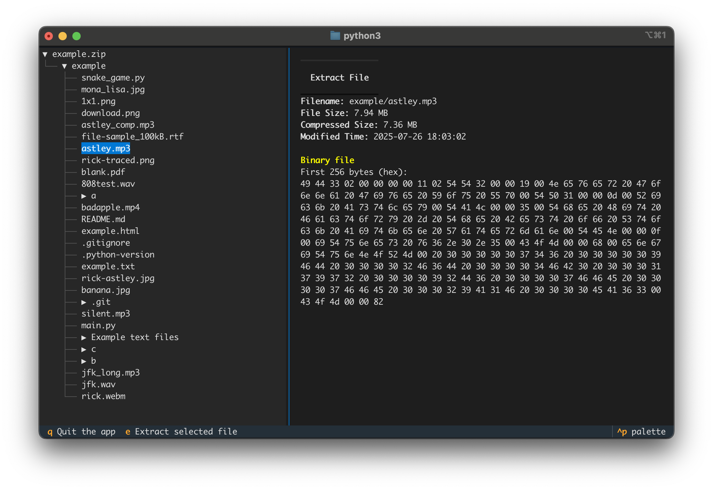

# zipviewer-tui

View and explore files in zip without unzipping

Uses [Textual](https://github.com/Textualize/textual) for TUI and [`imgcat`](https://iterm2.com/documentation-images.html) for viewing images in iTerm



## Demo


## Quickstart: Run without installing

```bash
uvx --from git+https://github.com/JBlitzar/zipviewer-tui zipviewer <zip_file_path>
```

## Installation

```bash
uv tool install git+https://github.com/JBlitzar/zipviewer-tui
```

### Installation for Development

```bash
git clone https://github.com/JBlitzar/zipviewer-tui.git && cd zipviewer-tui`
uv sync
uv tool install .
```

## Usage

```bash
zipviewer <zip_file_path>
```
